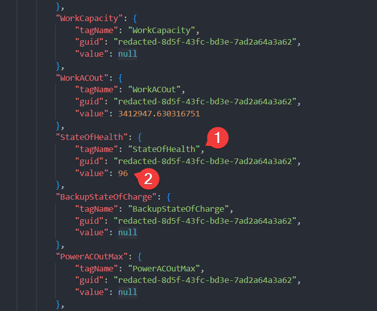

# kiwi

This tiny app makes it easy to read values from your **kiwigrid** powered devices via command line.


## What is "kiwigrid"?

[Kiwigrid](https://www.kiwigrid.com/) is a german smart metering platform you might already be using with your PV plant.

If you are using a PV battery from [SOLARWATT](https://www.solarwatt.de/) like I do and you are used to check your stats on [their EnergyManager portal](https://desktop.energymanager.com/), you're ready to go.

Other battery manufacturers might also be supported. In lack of test devices, I could not verify others.

## Usage

`kiwi` requires the ip address from your local API gateway which is sending your data to kiwigrid. Use the ip address with the `--ip` argument. Read on to find out how to discover your API gateway in your local network.

Your API gateway will provide many measurements for the devices that were registered upfront. You will need to query them with the name of the corresponding device. Read on to find the names of the devices that are available to you. These device names make the argument `--device`.

`kiwi` can read one or multiple values for the specified device. Simply define these values with the argument `--tag` as shown below. Usually, there are a lot of values in the response of your API gateway. Read on to find out which values are available to you.

### Querying a single value:

```powershell
kiwi read --ip=192.168.178.83 --device=MyReserve --tag=StateOfCharge

92.5
```

### Querying multiple values:

```powershell
kiwi read --ip=192.168.178.83 --device=MyReserve --tag=StateOfCharge --tag=ModeConverter --tag=StateOfHealth
  
{"StateOfCharge":"92.5","ModeConverter":"DISCHARGING","StateOfHealth":"96"}
```

### Include the timestamp of the API request

```powershell
kiwi read --ip=192.168.178.83 --device=MyReserve --tag=StateOfCharge --add-timestamp
  
{"StateOfCharge":"92.5","UtcTimeStamp":"2022-11-17T18:54:16.1410811Z"}
```

### Full command line reference
```powershell
kiwi --help
```

## Finding your local API gateway

To use this app, you need to know the ip address of your local API gateway which is sending your data to kiwigrid.

Scan your local network to find this device. If you find possible candidates, try them with this URL template:

 - http://IPADDRESS/rest/kiwigrid/wizard/devices

You should get a JSON response immediately. If you do, this is you local API gateway.

If you are using SOLARWATT's EnergyManager, you can find the local ip address easily.
Just head over to [the portal](https://desktop.energymanager.com/), login and click on the highlighted menu:


## Finding registered devices

Once you found the API gateway, you should be able to navigate to it with your browser. There you'll find the registered devices. These names are the values to be used with the argument `--device`.


### Verifying registered devices

In case you did not find the device you were looking for or you want to verify whether the found name is the correct one, navigate to your API gateway with your browser (see "Finding your local API gateway") and inspect the JSON response. Look for tag values with name "IdName". You should find one block whose value contains the name of the device you are looking for.


## Finding values to read

Once you found the API gateway you might want to inspect the values you can read from there. Simply navigate to your API gateway with your browser (see "Finding your local API gateway") and inspect the JSON response.

In the response, you will find many information blocks that are assigned to a device over a `guid`. This guid belongs to a device which is linked together in a "IdName" tag value (see image above).

These blocks also contain a `tagName` which is the metric like "StateOfHealth" and a `value` which holds the value for this metric.



In the example above, the following command ...

```powershell
kiwi read --ip=... --device=... --tag=StateOfHealth
```
would return the value `96`


